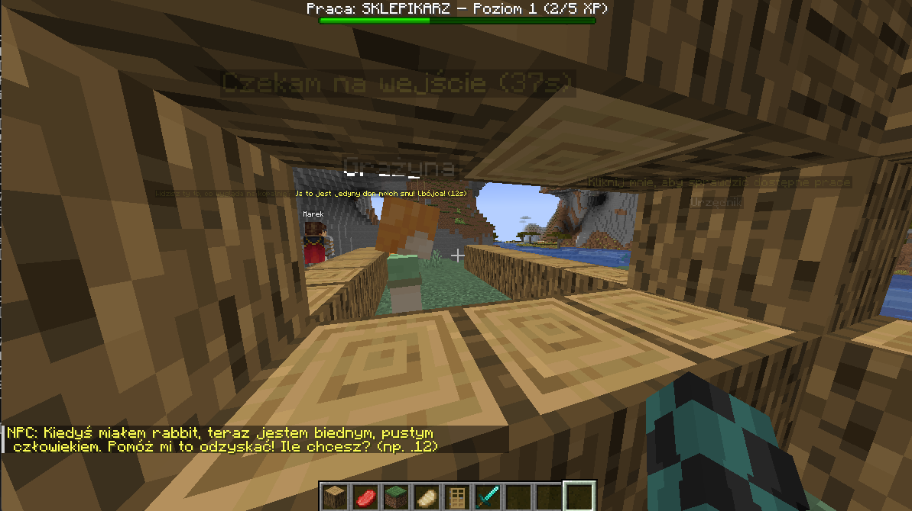
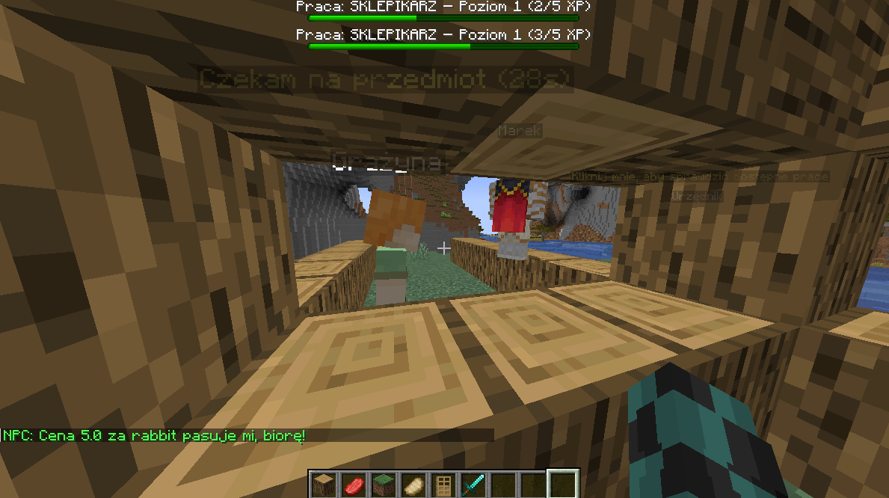
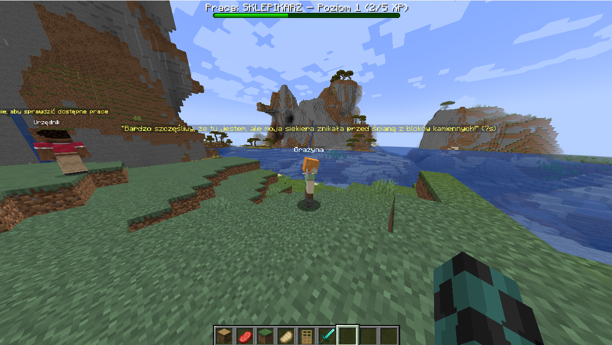

# 🛠️ Minecraft NPC Job System (PL)

Ten plugin dodaje do Minecrafta system prac, poziomowania, NPC z dialogami oraz interaktywne GUI — wszystko w pełni konfigurowalne przez YAML.

---

## ✨ Główne funkcje
- 🔹 NPC przypisujący pracę (np. SKLEPIKARZ)
- 🔹 GUI z wyborem prac
- 🔹 System XP i poziomów dla każdej pracy
- 🔹 Pasek bossbar z postępem gracza
- 🔹 Negocjacje cenowe z NPC (z poziomami cen z pliku `prices.yml`)
- 🔹 NPC mówiący losowe kwestie (dialogi YAML)
- 🔹 Wszystko oparte na Citizens2

---

## ❗ Uwaga – wersja bez AI

Ta wersja pluginu **nie zawiera sztucznej inteligencji NPC**.  
Jeśli interesuje Cię rozszerzona wersja z NPC poruszającymi się swobodnie, podejmującymi samodzielne decyzje, wchodzącymi w interakcje z otoczeniem i graczami – **mam gotowy, zaawansowany plugin z AI.**

💼 **Możliwość zakupu wersji AI — skontaktuj się na Discordzie: `@kondzio2003`** lub na mailu `urbanik-konrad@wp.pl**

---

## 📦 Wymagania
- Serwer Minecraft: **Paper 1.20.4**
- Pluginy:
  - Citizens2
  - Vault (dla ekonomii)
  - PlaceholderAPI (opcjonalnie)

---

## 🧰 Instalacja
1. Wrzuć `.jar` do folderu `/plugins`
2. Uruchom serwer (wygeneruje pliki)
3. Skonfiguruj:
   - `npc_texts/*.yml` — dialogi NPC
   - `prices.yml` — przedziały cen dla negocjacji
   - `prace.yml` — dostępne prace i XP wymagania
   - `npc_paths.yml` — opcjonalne ścieżki NPC

---

## 🧑‍💻 Autor
**Konrad Urbanik (`@kondzio2003`)**  
📬 Discord: `@kondzio2003`  
💼 Piszę pluginy na zamówienie — AI, NPC, ekonomia, custom systemy

---

## 📸 Zrzuty ekranu
## 📸 Przykładowe zrzuty ekranu

### NPC rozpoczynający interakcję

### GUI wyboru pracy

### Negocjacja ceny przez gracza

### AI  (nie dostępne w tej wersji)

> Więcej przykładów znajdziesz w folderze `screenshots/`

- NPC z ofertą pracy  
- GUI z wyborem profesji  
- NPC z dialogiem nad głową  
- Pasek bossbar z poziomem pracy  
